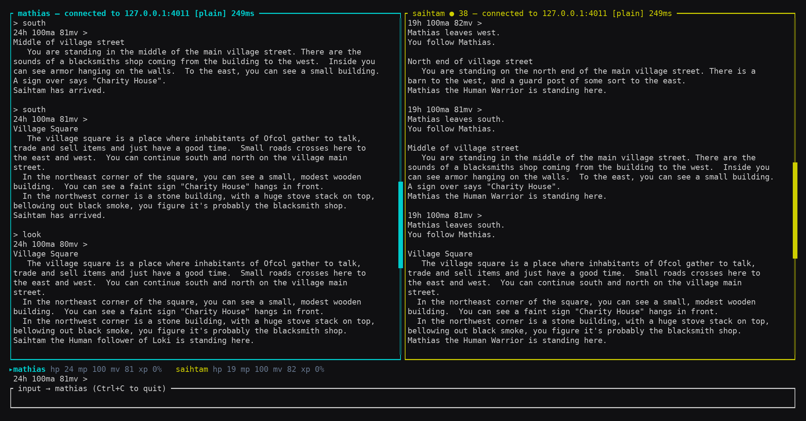
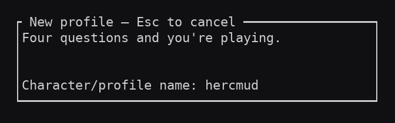
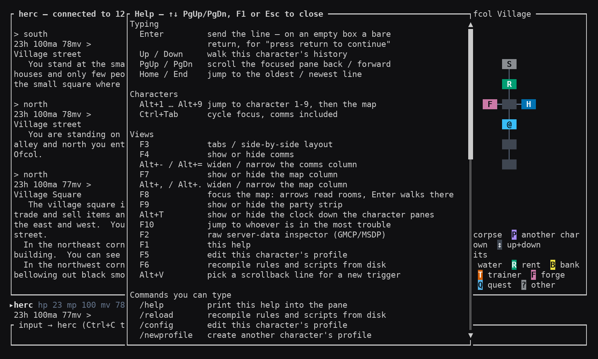
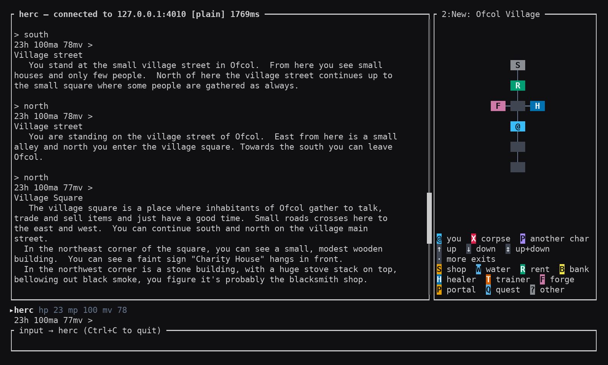

# Mudular

A MUD client that lives in your terminal. It plays several characters at once
in split panes, draws a map of where you've been as you walk, and can react to
what the game says — heal when you're hurt, loot a corpse, answer a tell —
without you typing anything.



## Installing it

### Windows

Open **Windows Terminal** — press Start, type `terminal`, open it. (It ships
with Windows 11. On Windows 10 search for `powershell` instead.) Paste this in
and press Enter:

```powershell
irm https://github.com/millermatt/mudular/releases/latest/download/mudular-installer.ps1 | iex
```

That's the whole install. It puts Mudular in `%USERPROFILE%\.cargo\bin` and
adds that to your PATH.

**Don't run it as administrator.** Mudular installs into your own user folder,
so an elevated window installs it for the wrong account and your normal prompt
won't find it afterwards. A plain window is what you want.

**Then close the terminal and open a new one** — a fresh window is what picks
up the PATH change. Now type:

```
mudular
```

If you'd rather have a traditional double-click installer, there's an `.msi` on
the [latest release](https://github.com/millermatt/mudular/releases/latest).
Windows will warn you it's from an unrecognised publisher (**More info** →
**Run anyway**), because the installer isn't signed by a company Microsoft
knows. The one-liner above avoids that warning and is the better bet if you
ever want Mudular to update itself.

### macOS and Linux

```sh
curl --proto '=https' --tlsv1.2 -LsSf https://github.com/millermatt/mudular/releases/latest/download/mudular-installer.sh | sh
```

Same idea: installs to `~/.cargo/bin` and puts it on your PATH. Open a new
terminal, then run `mudular`.

## Keeping it up to date

Mudular checks for a newer version when it starts, and mentions it in the first
pane if there is one. Nothing is downloaded until you ask, by typing:

```
/update
```

Then restart it. To stop it checking, put `check_for_updates: false` in
`mudular.yaml` (see [below](#settings-that-arent-about-one-character)).

If you used the `.msi` rather than the one-liner, `/update` can't help — it
will point you at the download page instead.

## Your first connection

The first time you run it with nothing saved, Mudular shows a short form
instead of an empty screen. It asks four things:

| Field | What to put |
|---|---|
| Name | Anything you like — it's just a label for this game, e.g. `hercmud` |
| Host | The MUD's address, e.g. `hercmud.net` |
| Port | The number the MUD listens on, e.g. `4443` |
| TLS | `yes` if the MUD uses an encrypted connection, `no` otherwise |



Press Enter after each one. `Esc` backs out without saving.

That's it — it connects straight away and remembers the game, so next time you
can just run:

```
mudular hercmud
```

Type a line and press Enter to send it to the game, exactly as you would in any
MUD client. Passwords are hidden as you type them.

## The keys worth knowing

**Press `F1` for help at any time** — it lists every key, so you don't have to
remember this table.

| Key | Does |
|---|---|
| `F1` | Help — all keys, always available |
| `F7` | Show or hide the **map** |
| `F8` | Move a cursor around the map to read room names, and walk there |
| `F9` | Show or hide the **party strip** (everyone's health along the bottom) |
| `F4` | Show or hide the **chat panes** (tells and channels, kept out of the main text) |
| `F3` | Switch between side-by-side panes and tabs |
| `Ctrl+Tab` | Jump to your next character |
| `Alt+1`, `Alt+2` … | Jump straight to a character by number |
| `F10` | Jump to whichever character is in trouble |
| `Alt+T` | Timestamp every line |
| `F5` | Edit the current character's settings, in the client |
| `Ctrl+C` | Quit |



## Playing more than one character

Name more than one game or character and each gets its own pane:

```
mudular mathias saihtam
```

Each has its own text, its own input line, and its own colour so you can tell
the panes apart at a glance. `Ctrl+Tab` moves between them, and a character you
aren't looking at shows a dot and a count when something new arrives.

The map builds itself as you walk — nothing to set up. `F8` moves a cursor
over it, and pressing Enter on a room walks you there one step at a time. You
can label rooms yourself, so the shop and the healer stay findable:



## Making it do things for you

Every character has a settings file where you can teach it to react. The
easiest way in is **`F5`**, which opens an editor for the current character
right inside the client — no hunting for files.

If you'd rather edit the file directly, paste this into the address bar of a
File Explorer window to land in the right folder:

```
%APPDATA%\mudular\config\profiles
```

(`%APPDATA%` is your **Roaming** folder — `C:\Users\<you>\AppData\Roaming` —
and works typed literally in the address bar.)

On a Mac that folder is `~/Library/Application Support/mudular/profiles`, and
on Linux `~/.config/mudular/profiles`.

Alongside `profiles` you may also see `maps`, and a `modules` folder if you
have made one — shared rule files live there, and Mudular does not create it
until you do.

A small example — press `k` to attack, and eat when you get hungry:

```yaml
name: mathias
host: hercmud.net
port: 4443

variables:
  target: rat

aliases:
  - pattern: 'k'
    send: ["kill ${target}"]

triggers:
  - pattern: 'You are hungry.'
    send: ["eat bread"]
```

Patterns are the text as the MUD prints it — `{name}` captures the part
that varies, `*` captures one without naming it, and everything else means
itself. `regex:` takes a regular expression instead, for what that can't
say.

Type `/reload` in the client to pick up changes without reconnecting.

### Settings that aren't about one character

Keybindings, chat panes, and how much scrollback to keep belong to the client
rather than to a character, and live in a file next to `profiles`:

```
%APPDATA%\mudular\config\mudular.yaml
```

On a Mac that's `~/Library/Application Support/mudular/mudular.yaml`, and on
Linux `~/.config/mudular/mudular.yaml`.

Mudular writes that file for you the first time it runs, with **every line
commented out** — so it changes nothing until you uncomment something, and
every value it shows is already the default. Open it to see what there is to
change. If you installed before this existed, copy
[`examples/config/mudular.yaml`](examples/config/mudular.yaml) into the folder
above instead.

Type `/reload`, or restart, to pick up changes.

That's the shallow end. Triggers can also highlight text, hide it, play a
sound, route it to a chat pane, or run a Lua script — and one character's
rules can command another, which is how a warrior gets healed by a cleric
without either player typing. **[docs/USAGE.md](docs/USAGE.md)** covers all of
it, with examples.

## If something looks wrong

- **Boxes or question marks instead of the map** — your terminal font is
  missing the characters it draws with. Windows Terminal's default (Cascadia
  Mono) is fine; older fonts may not be.
- **`mudular is not recognized`** — close the terminal and open a new one; the
  installer changed your PATH and only a fresh window sees it.
- **Anything else** — open an issue on the repository with what you did and
  what you saw.

## Building it yourself

If you'd rather build from source, you need [Rust](https://rustup.rs):

```sh
cargo build --release
cargo test
```

The binary lands in `target/release/mudular`.

## For the curious

- **[docs/USAGE.md](docs/USAGE.md)** — everything you can configure, in depth
- **[docs/ARCHITECTURE.md](docs/ARCHITECTURE.md)** — how it's built and why
- **[CHANGELOG.md](CHANGELOG.md)** — what changed in each release
- **[CONTRIBUTING.md](CONTRIBUTING.md)** — if you want to send a patch

## Licence

**GPL-3.0-or-later** — see [LICENSE](LICENSE). Use it, change it, share it; if
you distribute a modified version, it carries the same licence and its source
goes with it.

There are no per-file licence headers: the licence covers the whole work, and
this is a small enough project that a notice in every file would be more noise
than information.
